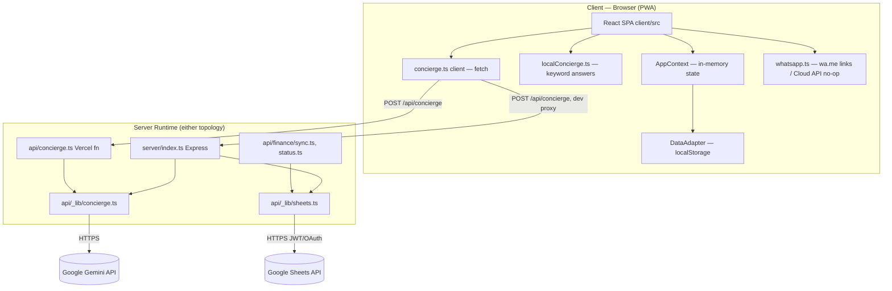

# 01 — Project Overview

> Current-state audit. All statements are facts drawn from the repository at commit `3393da3` (branch `main`, HEAD at audit time) unless explicitly marked "Assumption" or "Unknown."

## Project Name

- Repository name: `lami-command-center-by-mimo` (GitHub org: `Collective-by-Mimo`).
- In-app name / package name: `lami-command-center` (`package.json` → `name`).
- Product/brand name shown in the UI: **"LaMi"** / **"LaMi Command Center"** / **"LaMi — Mimo's Collective"** (see `client/index.html` `<title>`, `client/public/manifest.json`).
- `AI_CONTEXT.md` states the repo was previously named `lami-command-center-by--manus` and was renamed to the current name (same repository, per that document — not independently verifiable from git history alone).

## Primary Purpose

Per `AI_CONTEXT.md` and the in-app copy (`client/src/config/serviceCatalogue.ts`, `PROPOSITION.headline`):

> "One portal replaces twenty apps, twenty logins and twenty phone calls. You never chase a status. The status arrives."

The application is a **private, login-only Progressive Web App (PWA)** that lets an operator ("Mimo") run a lifestyle/concierge-management service for a single named client ("Layla"). It centralizes:
- Task/request tracking ("Cases")
- A financial ledger ("Finance")
- Utility/bill accounts ("Bills")
- A personal contacts directory ("Contacts")
- Shortcuts to external provider portals ("Connections")
- A catalogue of the concierge service offering ("Services")
- An AI chat assistant ("Concierge")

## Target Users

Two roles, both authenticating through the same shared login gate (see `03_System_Architecture.md` for the auth mechanism):

1. **Operator** ("Mimo" / Movsum Mirzazada, per `client/src/services/dataAdapter.ts` `exportDataJSON()` and `OperatorPanel.tsx`) — full CRUD control over cases, finance, briefing text, and handoff replies.
2. **Client** ("Layla Karoline Aparecida", named in the same export function and throughout UI copy, e.g. `LoginScreen.tsx`, `ConciergeAI.tsx` greeting) — views status, approves decisions, chats with the Concierge.

There is **no true multi-user account system**: both roles share one login credential; "operator" vs. "client" is a client-side UI mode toggle, not a server-verified identity (see Risk Assessment, `11_Risk_Assessment.md`).

## Current Development Stage

- Single-tenant, pre-production / early-stage private deployment. `AI_CONTEXT.md` describes a phased roadmap where Phases 1–3 are marked "DONE" and Phases 4–6 are "planned" / not built:
  - Phase 1 (operator-by-default access) — DONE
  - Phase 2 (13-category taxonomy rebuild) — DONE
  - Phase 3 (finance cash-flow: Paid By / Payment Method / running balance) — DONE
  - Phase 4 (Notion as source of truth) — NOT built (app still uses `localStorage`)
  - Phase 5 (invoice/email/WhatsApp/Sheets automation on submit) — NOT built
  - Phase 6 (AI task-creation agent) — NOT built
- `FinanceScreen.tsx` renders a visible in-app warning banner: *"⚠️ Real authentication pending — do not publish with real financial data until Phase 2."* (Note: this banner's own text refers to a different "Phase 2" than the AI_CONTEXT.md phase numbering — see `12_Open_Questions.md`.)
- No automated test suite exists (`vitest` is a declared devDependency; zero `*.test.*`/`*.spec.*` files were found in the repository).
- No CI/CD pipeline exists (no `.github/workflows` directory).

## Current Capabilities (as implemented in code)

- Private password-gated login (client-side check) with optional WebAuthn/biometric login.
- Case/task management: create, edit, filter by state and category, nested nested nested category taxonomy (13 built-in categories + user-added custom categories), subtasks with a progress chart, quotation comparison, one-tap decision approval, timeline/history log, completion with photo proof, archive of completed cases.
- Finance ledger: income/expense/reimbursement entries in AED, "Paid By" and multi-select "Payment Method" tags, monthly and all-time running balance, receipt photo attachment (base64), CSV export, and a server-gated Google Sheets sync.
- Bills/Utilities: a hardcoded list of 4 utility accounts with tap-to-copy account numbers and call buttons.
- Contacts: a hardcoded categorized directory with `tel:` and `wa.me` deep links.
- Connections: a hardcoded grid of external provider-portal links (opened in a new browser tab; no credentials stored or transmitted).
- Services: a static read-only catalogue of the full service offering with status badges (Live / Ready / Phase 2).
- Concierge AI: a chat widget that first tries to answer from local app data via keyword matching (`localConcierge.ts`), and falls back to a server-side Gemini call (`api/concierge.ts` / `server/index.ts`) with a sanitized data payload; any failure degrades to a static WhatsApp hand-off message.
- "Handoff" queue: unanswered concierge questions are logged and shown to the operator for manual reply or conversion into a new case.
- Proactive "Radar" suggestions: hardcoded key dates (`client/src/data/keydates.json`) that surface as accept/dismiss prompts a configurable number of days ahead of the date.
- PWA installability (manifest + service worker with cache-first/network-first hybrid strategy) and an install-prompt banner.
- JSON export/import backup of all local data, and a "reset to seed data" operator action.
- WhatsApp integration: per-case `wa.me` deep links (always active) and a WhatsApp Business Cloud API notification sender (`whatsapp.ts`) that is a documented no-op until Meta credentials are configured.

## Major Limitations (as of this audit)

- **No real backend data store.** All application data (cases, finance, utilities, key dates, handoffs, custom categories) lives in the browser's `localStorage` via `client/src/services/dataAdapter.ts`. Data does not sync across devices and is lost if browser storage is cleared.
- **No real user authentication.** Login is a single shared username/password pair compared client-side in `AppContext.tsx`, with the password inlined into the built JS bundle if set via `VITE_APP_PASSWORD` (or hardcoded to `@Mimo2026` otherwise). A code comment explicitly states: *"like any client-side gate, the value is still inlined into the built bundle — treat it as a gate, not a secret."*
- **Notion is not wired in**, despite being referenced throughout as the intended source of truth (`AI_CONTEXT.md`: "Notion is NOT yet wired into the app"). No Notion API calls exist anywhere in the codebase.
- **Receipt photos are stored as base64 strings inside `localStorage`**, not in cloud/object storage — a code comment marks this "Phase 1 only" / "TODO cloud storage."
- **No automated tests.** No CI pipeline.
- **WebAuthn (biometric login) implementation is non-standard**: the challenge is generated client-side (not server-issued) and the credential ID is stored/compared in `localStorage`, which does not provide the security guarantees WebAuthn is designed for (see `11_Risk_Assessment.md`).
- **A large shadcn/ui component library is present in `client/src/components/ui/` (54 files) but zero of these components are imported by any of the application's actual screens** — confirmed by repository-wide search. This is dead/unused scaffolding.
- **Several declared npm dependencies are unused** in the shipped application code (see `09_Dependency_Report.md`): `zod`, `nanoid`, `streamdown`, `@hookform/resolvers` have no importing file anywhere in `client/src`, `server/`, or `api/`.
- **`ErrorBoundary.tsx` component exists but is never imported or rendered anywhere** (not wrapped around `<App/>` in `main.tsx` or elsewhere) — dead code.
- **`ideas.md`, at the repository root, describes a trilingual (PT/EN/HE) RTL design brief** that contradicts the current English-only, LTR implementation described in `AI_CONTEXT.md` and confirmed in code (`types/index.ts`: `Language = 'en'`). This file was not updated when the language layer was removed (commit `5a7f6e2`, "Convert app to English-only, LTR").

## Overall Architecture Summary

A single Vite + React 19 + TypeScript SPA (`client/`) that can run in two deployment topologies from the same codebase:
1. **Vercel serverless**: the SPA is served as static output (`dist/public`), and two API routes (`/api/concierge`, `/api/finance/*`) run as individual Vercel serverless functions defined under `api/`.
2. **Standalone Node/Express**: `server/index.ts` bundles into `dist/index.js` (via esbuild) and serves both the static build and the same two API routes through an Express app, for non-Vercel hosting.

Both entry points share business logic from `api/_lib/concierge.ts` and `api/_lib/sheets.ts`. There is no database; the only "backend" state is two pieces of externally-configured secret-gated integration (Gemini API key; Google service-account credentials), both optional and both degrading gracefully to a client-only mode when unset.

## Repository Statistics

Measured directly (excluding `node_modules`, `.git`; `dist` and `node_modules` are not present in this checkout):

| Metric | Value |
|---|---|
| Total tracked files (non-`.git`) | 108 |
| Client TypeScript/TSX source lines (`client/src/**/*.ts*`) | 13,266 |
| Application-specific components (`client/src/components/*.tsx`, excluding `ui/`) | 21 files, 4,359 lines |
| Generic/shadcn `ui/` component files (`client/src/components/ui/*.tsx`) | 54 files (not separately counted for lines; confirmed **unused** by app code) |
| Server code (`server/index.ts`) | 67 lines |
| Serverless API code (`api/**/*.ts`) | 286 lines total across 7 files |
| Config/services/context/data (`config`, `services`, `context`, `data`, `hooks`, `utils`) | ~2,807 lines (excluding components) |
| Largest component | `FinanceScreen.tsx` (641 lines) |
| Second largest | `CaseDetailScreen.tsx` (529 lines) |
| Automated test files | 0 |
| CI/CD workflow files | 0 |
| Git commits on `main` (visible in `git log`) | 20+ (full history not exhaustively counted; oldest visible commit adds contacts/WhatsApp features) |

## Main Technologies

- **Language:** TypeScript (strict mode enabled in `tsconfig.json`), ESM (`"type": "module"` in `package.json`).
- **Frontend framework:** React 19.2.1 + React DOM 19.2.1.
- **Build tool:** Vite 7.1.7, with `@vitejs/plugin-react`, `@tailwindcss/vite`.
- **Styling:** Tailwind CSS 4.1.14 (+ `tailwindcss-animate`, `@tailwindcss/typography`), custom CSS variables/tokens in `client/src/index.css`.
- **UI component base:** shadcn/ui convention (`components.json`, style "new-york") on top of Radix UI primitives — present but unused by the shipped screens (see Limitations above).
- **Animation:** `motion` (Framer Motion successor package, imported as `motion/react`) — used extensively across screens.
- **Charts:** `recharts` (used in `SubtaskProgressChart.tsx`).
- **Icons:** `lucide-react`.
- **Backend (optional standalone mode):** Express 4.21.2, Node `http` module, `tsx` for dev, `esbuild` for production bundling.
- **Serverless (optional Vercel mode):** Vercel serverless functions (`api/*.ts`), configured via `vercel.json`.
- **External AI provider:** Google Gemini (`gemini-2.5-flash-lite` primary, `gemini-2.5-flash` fallback) via direct REST calls — no SDK dependency.
- **External integration:** Google Sheets API v4 (service-account JWT auth, implemented manually with Node's `crypto` module — no `googleapis` SDK dependency).
- **PWA:** hand-written `client/public/sw.js` service worker + `client/public/manifest.json`.
- **Package manager:** pnpm (`pnpm@10.4.1` pinned in `package.json` "packageManager" field; devDependency also lists `pnpm@^10.15.1`, a discrepancy — see `12_Open_Questions.md`).
- **Dev/build tooling artifacts of note:** the repository contains build-time integration with a platform called "Manus" (`vite-plugin-manus-runtime`, a debug-log collector plugin, a storage proxy plugin, `client/public/__manus__/debug-collector.js`, and a full scaffold snapshot in `template.json`). These appear to be development-platform scaffolding rather than application features — see `02_Repository_Map.md` and `08_Configuration_Report.md`.
