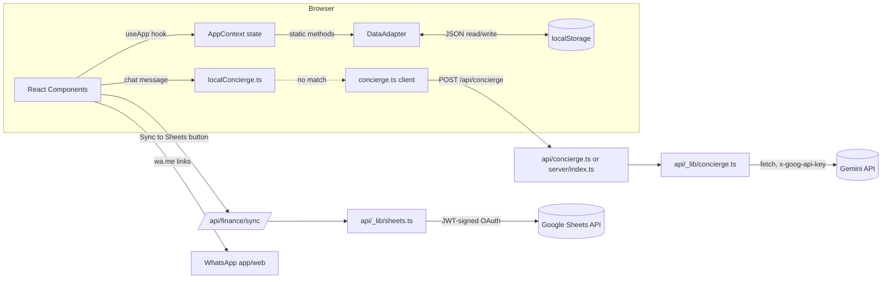

# 03 — System Architecture

## Frontend Architecture

- **Type:** Single-Page Application (SPA), one HTML document (`client/index.html`), no URL-based routing library. Navigation between "screens" is done by setting a `currentView` string in React state (`ViewMode` type in `client/src/types/index.ts`); the browser URL never changes.
- **State management:** One global React Context (`client/src/context/AppContext.tsx`) created with `createContext`/`useContext`, providing ~45 fields/functions to the entire component tree (see the `AppContextType` interface). There is no Redux, Zustand, Jotai, or other external state library.
- **Component structure:**
  - `App.tsx` — root; renders `LoginScreen` if unauthenticated, otherwise a persistent shell (`Header`, `Navbar`, `ConciergeAI` floating button, `OperatorPanel`, `ProofModal`, `Toast`, `InstallBanner`) around whichever screen `currentView` selects, with `AnimatePresence`/`motion.div` page-transition animation (Framer Motion "successor" package `motion`).
  - 21 screen/feature components in `client/src/components/*.tsx` (see `04_Feature_Catalog.md` for the full list).
  - 54 additional files in `client/src/components/ui/*.tsx` implement the shadcn/ui component set (Radix UI wrappers) but — confirmed by repository-wide search — **are not imported by any of the 21 application components, `App.tsx`, or `main.tsx`.** They are unused in the running application.
- **Styling:** Tailwind CSS v4 utility classes, inlined hex colors matching the documented design tokens (`#F7F5F1` cream, `#145A52`/`#0E3F3A` teal, `#B8912E` gold), plus a small set of custom classes/animations defined in `client/src/index.css` (not fully enumerated in this audit — see `12_Open_Questions.md`).
- **Data flow within the frontend:** Screens call functions exposed by `useApp()` (the `AppContext` hook) to read state and to trigger mutations (e.g., `createNewCase`, `addTransaction`, `resolveDecision`). Every mutation function in `AppContext` follows the same pattern: call a static method on `DataAdapter` → call `refreshData()` to re-read all collections from `DataAdapter` back into React state → optionally show a toast. There is no fine-grained reactivity; any mutation re-reads and re-renders all top-level collections.
- **Persistence:** `DataAdapter` (`client/src/services/dataAdapter.ts`) is a class with only `static` members and module-level fields, effectively a singleton. Each collection (`cases`, `briefing`, `utilities`, `keyDates`, `handoffs`, `transactions`) is loaded once at module-evaluation time from `localStorage` (falling back to seed data in `client/src/data/seedData.ts` and `client/src/data/keydates.json`), held in memory, and written back to `localStorage` (JSON-serialized) on every mutation.
- **PWA layer:** `client/public/sw.js` is registered from both `client/index.html` (inline script, guarded by `location.hostname !== 'localhost'`) and again from inside `AppContext.tsx`'s effect (guarded only by `serviceWorker in navigator` and `location.protocol !== 'file:'`) — i.e., **service-worker registration is attempted from two separate places** (see `11_Risk_Assessment.md`).

## Backend Architecture

There is no traditional backend/application server with business logic beyond two narrow integrations. Two parallel runtime topologies exist, sharing library code:

1. **Vercel serverless functions** (`api/concierge.ts`, `api/finance/status.ts`, `api/finance/sync.ts`) — each file's default export is invoked per-request by Vercel's Node runtime; no shared process state between invocations.
2. **Standalone Express server** (`server/index.ts`) — a single long-lived Node process registering the same three routes plus static file serving and an SPA catch-all (`app.get('*', ...)`).

Both call into the same two library modules:
- `api/_lib/concierge.ts` — builds the Gemini system prompt (hardcoded persona/rules for "the LaMi Concierge") and calls the Gemini REST API directly via `fetch`, trying `gemini-2.5-flash-lite` first and falling back to `gemini-2.5-flash` on any failure. Never throws to its caller — always resolves to `{ reply, fallback }`.
- `api/_lib/sheets.ts` — reads a Google service-account JSON credential from an env var, manually constructs and signs a JWT (`crypto.createSign('RSA-SHA256')`), exchanges it for an OAuth2 access token, then clears and rewrites a fixed range (`A1:I100000`) of the target spreadsheet's first sheet with the full transaction ledger on every sync call (full overwrite, not incremental).

There is **no request authentication/authorization on any API route** beyond HTTP method checks (`POST`/`GET`). Any client that can reach the deployed URL can call `/api/concierge` or `/api/finance/sync` (see `07_API_Inventory.md` and `11_Risk_Assessment.md`).

## APIs

Three total HTTP endpoints, all detailed in `07_API_Inventory.md`. Summary:
- `POST /api/concierge` — proxies a chat message + a client-supplied "grounding data" JSON blob to Gemini; returns `{ reply, fallback }`.
- `GET /api/finance/status` — returns `{ sheetsConfigured: boolean }`, indicating whether server-side Google Sheets credentials are present.
- `POST /api/finance/sync` — accepts the full transaction ledger from the client and overwrites a configured Google Sheet with it.

No other internal APIs exist. No GraphQL. No WebSockets. No queues.

## Database

**None.** There is no SQL or NoSQL database, no ORM, no migration files, no schema files (beyond TypeScript interfaces). All persistent application data lives in the browser's `localStorage` (see `06_Data_Model.md`).

## Authentication

- **Mechanism:** A single hardcoded/env-overridable username+password pair, compared in plain client-side JavaScript (`AppContext.tsx` → `login()`). Default credentials (used when env vars are unset): username `Layla_Portal`, password `@Mimo2026` (both visible in source and in `AI_CONTEXT.md`).
- **Session:** A boolean flag (`lami_authenticated === 'true'`) stored in `localStorage`; no token, no expiry, no server-side session store, no refresh mechanism.
- **Biometric option:** WebAuthn-based "biometric login" (`client/src/utils/webauthn.ts`) is offered as a secondary factor, but the challenge is generated client-side with `window.crypto.getRandomValues` (not issued by a server) and the resulting credential ID is stored in and compared against `localStorage` — this does not implement the server-verification step that gives WebAuthn its security properties. A code comment in `webauthn.ts` acknowledges this: *"In a real scenario, this would come from a server challenge."*
- **Authorization ("operator" vs. "client" mode):** A separate boolean (`isOperator`), defaulting to `true` for any authenticated user, togglable via URL query params (`?op=0`/`?op=1`/`?operator=1`/`?client=1`) or a 3-second long-press on the header logo, persisted in `localStorage` as `lami_op_mode`. This is a UI-only visibility toggle, not a security boundary — any authenticated user can flip it back at will (the app's own code comments describe this as intentional for the current phase: *"AUTH: Supabase multi-user — Phase 2 integration point"*, appearing identically in both `server/index.ts` and `AppContext.tsx`, marking real auth as future work).
- **No server-side auth exists on the API routes** — the "auth" boundary is entirely inside the SPA.

## Storage

- **Application data:** `localStorage`, namespaced under keys like `lami_cases_data_v1`, `lami_briefing_data_v1`, `lami_utilities_data_v1`, `lami_keydates_data_v1`, `lami_handoffs_data_v1`, `lami_finance_data_v1`, plus smaller flags (`lami_authenticated`, `lami_biometric`, `lami_op_mode`, `lami_haptics_enabled`, `lami_custom_categories_v1`, `lami_whatsapp_queue_v1`, `lami_authn_cred_id`, `briefing-visited`).
- **File/photo storage:** None (no object storage / CDN integration). Receipt photos and completion-proof photos are read client-side via `FileReader.readAsDataURL()` and stored as base64 strings directly inside the `localStorage`-persisted JSON — bounded only by a client-side 2 MB per-file check in `FinanceScreen.tsx` (no such size check exists for case completion-proof photos, which accept a raw URL string instead of a file upload).
- **Caching:** The PWA service worker (`client/public/sw.js`) maintains two named Cache Storage buckets (`lami-command-center-v3`, `lami-dynamic-v3`).

## Sessions

No server-side session store exists (see Authentication above). "Session" state is entirely client-side `localStorage` flags with no expiry.

## Configuration Data

Static, code-level configuration (not user-editable through any admin UI) lives in `client/src/config/appConfig.ts` (contacts, connections, case categories, finance categories, paid-by/payment-method option lists, home address) and `client/src/config/serviceCatalogue.ts` (the full services offering). "Custom" case categories added by a user at runtime are the one exception, persisted to `localStorage` under `lami_custom_categories_v1`.

## AI Providers

- **Google Gemini** (`generativelanguage.googleapis.com`) — the only external AI provider, called directly via `fetch` with an API-key header (`x-goog-api-key`), no SDK. Models: `gemini-2.5-flash-lite` (primary), `gemini-2.5-flash` (fallback on any error). See `05_AI_and_Automation.md` for full prompt and routing detail.
- No other AI providers (OpenAI, Anthropic, Azure OpenAI, etc.) are referenced anywhere in the code, despite `AI_CONTEXT.md`'s Phase 6 notes mentioning "Gemini/Azure if configured" in a code comment inside `localConcierge.ts` — no Azure code path actually exists (see `12_Open_Questions.md`).

## External Services

| Service | Purpose | Integration status |
|---|---|---|
| Google Gemini API | Concierge open-ended Q&A | Live (conditional on `GEMINI_API_KEY` being set) |
| Google Sheets API | Finance ledger export/sync | Live (conditional on `GOOGLE_SHEETS_CREDENTIALS`/`GOOGLE_SHEETS_SPREADSHEET_ID`) |
| WhatsApp (`wa.me` deep links) | Per-case and per-contact "message Mimo" links | Live, no credentials needed (opens WhatsApp with a pre-filled message) |
| WhatsApp Business Cloud API (Meta) | Server-push notifications (new case, awaiting approval, completed, suggestion) | **Not live** — coded as a documented no-op that queues messages in `localStorage` until `VITE_WHATSAPP_TOKEN`/`VITE_WHATSAPP_PHONE_ID`/`VITE_LAYLA_WHATSAPP` are set; these are client-side (`VITE_`) env vars, meaning a real token would be exposed in the built JS bundle if ever configured this way (see `11_Risk_Assessment.md`) |
| Notion | Intended future source of truth (per `AI_CONTEXT.md`) | **Not integrated** — no code references the Notion API anywhere in the repository |
| Google Fonts (`fonts.googleapis.com`/`fonts.gstatic.com`) | Cormorant Garamond + Inter typefaces | Live, loaded via `<link>` tags in `client/index.html`, cached by the service worker |
| An analytics endpoint (Umami-style, `%VITE_ANALYTICS_ENDPOINT%`) | Referenced as an unresolved template placeholder in `client/index.html` | **Not configured** anywhere in the repo; effectively inert unless the build pipeline substitutes these placeholders from outside the repository (Unknown — no substitution mechanism was found in this codebase) |

## Event Flow

There is no event bus, message queue, or webhook receiver in this application. "Events" are:
1. Native browser events (`online`/`offline`, `beforeinstallprompt`) handled in `AppContext.tsx`.
2. Service-worker lifecycle events (`install`, `activate`, `fetch`, `message`) in `sw.js`.
3. Application-level "events" that are really just direct function calls through the context (e.g., a client tapping "Approve" calls `resolveDecision`, which synchronously updates `DataAdapter` state and re-renders).

## Data Flow

## Request Lifecycle

**Concierge chat message (typical case, no server call):**
1. User types a message in `ConciergeAI.tsx` and submits.
2. `answerLocally()` (`localConcierge.ts`) tests the lowercase message against a fixed set of keyword groups (greetings, finance, bills, pending/awaiting, completed, in-progress, upcoming, contact, counts, topic match, broad "list").
3. If a keyword group matches, a templated string built from live `AppContext` data (cases/utilities/transactions/keyDates) is returned immediately (with an artificial 600 ms `setTimeout` for the "typing" UI effect) — **no network request is made.**

**Concierge chat message (fallback to server):**
1. No local keyword matches.
2. `buildGroundingData()` (`services/concierge.ts`) constructs a sanitized JSON snapshot of cases/utilities/keyDates/briefing, explicitly excluding internal fields (`id`, `internalStatus`, `priority`, account numbers, etc., per inline comments).
3. `askConcierge()` does `fetch('/api/concierge', { method: 'POST', body: { message, language, groundingData } })`.
4. Server-side (`api/_lib/concierge.ts`): if `GEMINI_API_KEY` is unset or the message is empty, immediately returns the static fallback string. Otherwise builds a system prompt embedding the grounding data as literal JSON and calls Gemini (`gemini-2.5-flash-lite`, then `gemini-2.5-flash` on failure), with `maxOutputTokens: 220`, `temperature: 0.3`, `thinkingBudget: 0`.
5. Any error at any step (missing key, network failure, empty model output) is caught and converted into `{ reply: CONCIERGE_FALLBACK, fallback: true }` — the client always receives HTTP 200 with a well-formed body.

**Finance Google Sheets sync:**
1. Operator taps "Sync to Google Sheets" in `FinanceScreen.tsx`.
2. Client strips `receiptBase64` from every transaction, flattens `paymentMethods` into a `+`-joined string, attaches the precomputed running balance, and POSTs the array to `/api/finance/sync`.
3. Server checks for `GOOGLE_SHEETS_CREDENTIALS`/`GOOGLE_SHEETS_SPREADSHEET_ID`; if absent, returns `{ synced: false, reason: 'credentials_pending' }` with HTTP 200.
4. If present, signs a JWT, exchanges it for an OAuth token, calls `values/{range}:clear` then `values/{range}` (`PUT`, `valueInputOption=RAW`) against the Sheets API, overwriting the entire configured range with a header row plus one row per transaction.
5. Any thrown error (clear failure, write failure, token exchange failure) results in HTTP 502 `{ synced: false, reason: 'sync_failed' }`.

**PWA navigation (offline-aware):**
1. Every same-origin navigation request first tries the network; on success, the response is cloned into the `lami-command-center-v3` cache under the `/` key.
2. On network failure, the service worker serves the cached `/` (or `/index.html`) response.
3. Static assets (fonts, scripts, styles, images) use stale-while-revalidate; everything else uses network-first-with-cache-fallback into the `lami-dynamic-v3` cache.
